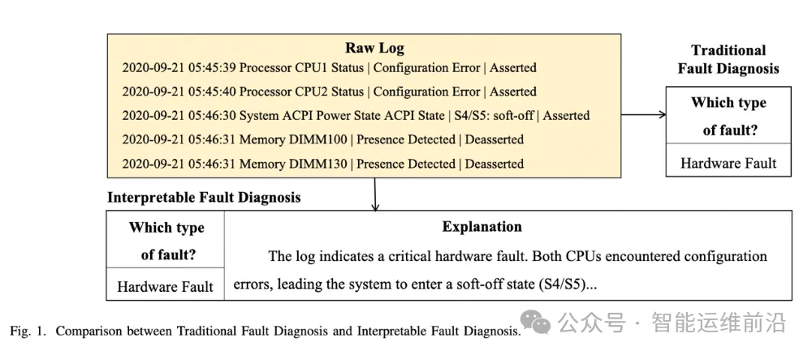
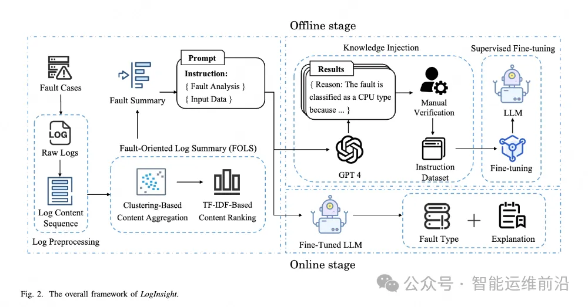
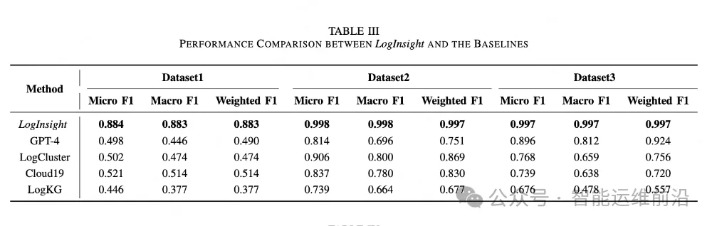

# LogInsight：基于大语言模型的准确而可解释的日志故障诊断方法

> **简介：** 本文介绍了由南开大学、清华大学、中国移动、中兴通讯等单位发表的最新研究成果。该论文已被计算机科学领域CCF
> A类国际期刊——IEEE Transactions on Services Computing（TSC）正式录用。 
> **论文标题：** Accurate and Interpretable Log-Based Fault Diagnosis using Large Language Models  
> **作者：** 孙永谦，马诗雨，肖桐，赵咏欣，蔡旭辉，董威，申玥，赵耀，张圣林*，韩静，裴丹  
> **作者单位：** 南开大学、清华大学、中国移动、中兴通讯  

## 01 - 摘要

在大规模复杂的在线服务系统中，故障发生会显著影响系统性能，甚至波及数百万用户。
每当系统出现故障，运维工程师需依赖故障期间产生的大量日志数据进行分析，以快速定位和修复问题。然而，现有方法在处理海量日志时，常常面临诊断准确性不足和缺乏可解释性的双重挑战，导致诊断结果难以令人信服。

大语言模型（LLMs）因其强大的预训练能力，在日志分析领域展现出巨大潜力，但由于缺乏针对故障诊断的专业知识和领域洞察，难以直接应用于日志故障诊断任务。此外，LLMs存在上下文长度限制，很难直接将完整日志输入到LLMs中。

针对上述问题，本文提出了LogInsight——一个基于LLMs，兼具高准确性与可解释性的日志故障诊断框架。我们通过对中等规模开源LLM进行领域微调，充分挖掘其解释能力，
并设计了面向故障的日志摘要模块(Fault-Oriented Log Summary，FOLS)，专门用于从海量日志序列中提取关键信息，以缓解上下文长度限制。

通过在两个公开数据集和一个真实生产数据集上的广泛评估，结果显示LogInsight在性能和可解释性方面均优于现有主流方法。

## 02 - 背景与挑战

在现代大规模复杂的在线服务系统中，故障不仅会导致服务中断，还可能影响数百万用户。每当系统发生故障，运维工程师必须从海量日志中分析并定位问题。

然而，故障期间产生的日志往往庞杂冗长，其中既包含大量噪声，也夹杂无关或重复信息，真正有价值的线索稀少且分散，使得传统方法在信息干扰下难以保证诊断的准确性。

虽然大语言模型（LLMs）凭借强大的预训练能力在日志分析领域展现出潜力，但它们并非专为故障诊断设计，缺乏必要的领域知识与上下文理解能力。

同时，LLMs在处理日志时受到上下文窗口限制，无法一次性分析全部数据，可能遗漏关键诊断信息。这些因素共同制约了现有技术在实际运维场景中实现高准确性和强可解释性。

图1：传统故障诊断和可解释的故障诊断的对比。
针对上述挑战，团队提出了 LogInsight——一个结合大语言模型与面向故障的日志摘要技术的诊断框架，旨在在提升诊断准确性的同时，增强诊断结果的可解释性。

## 03 - 核心方法与系统架构图

LogInsight的整体框架如下图：

图2：LogInsight的整体框架。
整体框架包括四个主要步骤：
1. 首先，利用正则表达式对原始日志进行预处理，提取出关键内容并形成结构化的日志序列；
2. 其次，设计了面向故障的日志摘要（FOLS）模块，通过聚类和TF-IDF排序，有效聚合和筛选出故障相关的核心日志信息，显著减少冗余，缓解大语言模型（LLM）在上下文长度上的限制；
3. 第三，采用知识注入策略，结合GPT-4自动生成解释并由专家人工校验，构建高质量的指令数据集；
4. 最后，利用LoRA技术对开源中等规模LLM进行监督微调，使模型具备领域特定知识和解释能力，从而实现准确且可解释的日志故障诊断。

## 04 - 实验验证

LogInsight的实验验证部分在两个公开数据集和一个真实生产数据集上进行了广泛评估。结果显示，LogInsight在故障诊断的准确性和可解释性方面均显著优于现有主流方法。

具体来说，微调后的LogInsight模型在各项指标上表现稳定，能够有效应对不同数据分布和不平衡的故障类型。

此外，系统能够在平均8.5秒内完成一次故障诊断，满足实际在线部署的实时性需求。用户研究还表明，LogInsight生成的解释在有用性和可读性方面获得了较高评价，有助于运维工程师理解和验证诊断结果。

实验还验证了LogInsight对多种主流大语言模型架构的兼容性和适应性，体现了其良好的灵活性和鲁棒性。

表1：LogInsight相较于基座模型的效果表现

## 05 - 研究意义与展望

该论文针对现代在线服务系统中日志故障诊断的准确性和可解释性难题，提出了基于大语言模型的LogInsight方法，有效提升了日志分析的智能化水平和运维效率。

研究不仅验证了该方法在实际生产环境中的优越性能，还为故障诊断领域引入了可解释性的新范式。
展望未来，随着系统环境的不断变化和新型故障类型的出现，作者计划探索更为鲁棒的模型微调策略，如融合外部知识库和自监督学习，以增强对新型、少见或未知故障类型的诊断能力，并推动智能运维技术在更广泛场景中的应用与发展。

#### 文章来源:
> https://mp.weixin.qq.com/s/IfdhN2vnNXvYWnZZfoe-KA